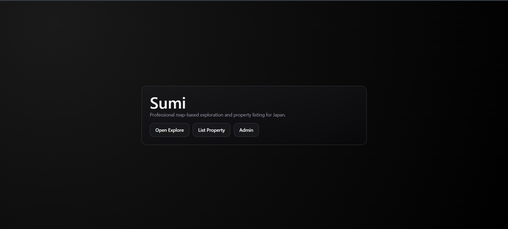
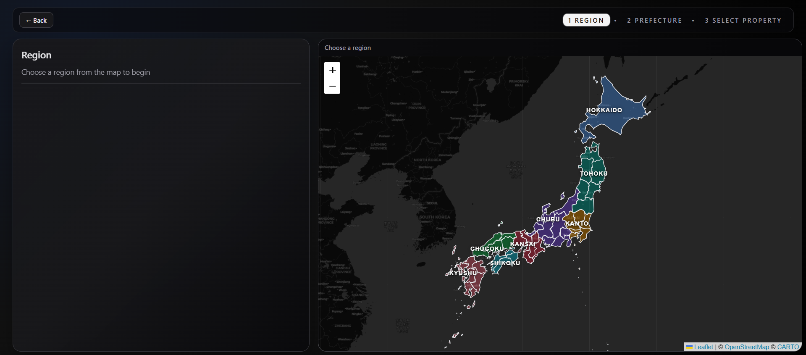
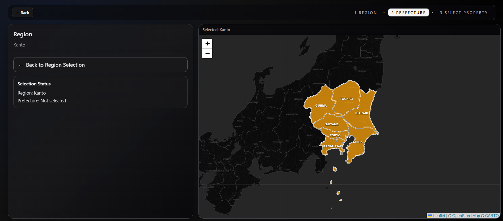
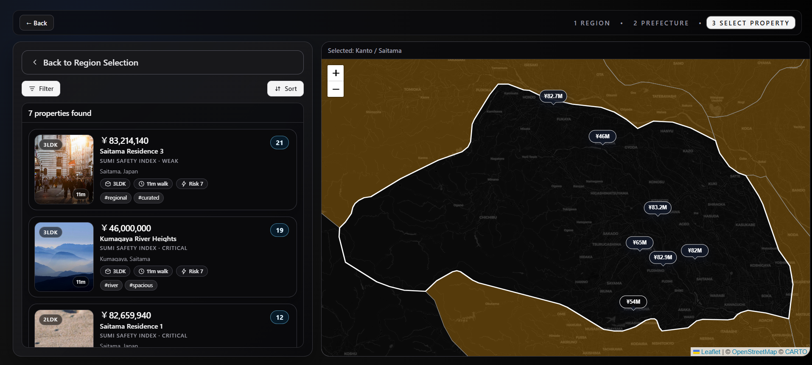
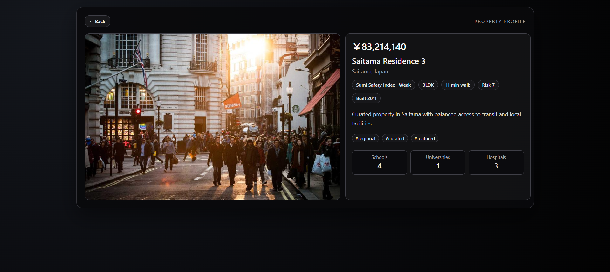

<h1 align="center">Sumi</h1>

<p align="center">
	A map-first home discovery experience for Japan that blends location, safety context, and livability signals.
</p>

<p align="center">
	<a href="#product-journey">Journey</a> •
	<a href="#why-sumi">Why Sumi</a> •
	<a href="#feature-highlights">Features</a> •
	<a href="#screenshots">Screenshots</a> •
	<a href="#getting-started">Getting Started</a>
</p>

<table align="center">
	<tr>
		<td><strong>Map-first discovery</strong></td>
		<td><strong>Risk-aware insights</strong></td>
		<td><strong>Region to home flow</strong></td>
	</tr>
	<tr>
		<td>Explore homes spatially, not as flat lists.</td>
		<td>Compare earthquake risk, elevation, and nearby essentials.</td>
		<td>Move from region, to prefecture, to detailed listing decisions.</td>
	</tr>
</table>

Most property sites optimize for price comparison but hide context. Sumi solves this by surfacing local risk and quality-of-life signals in the same place users compare homes.

## Product Journey

1. Start from a high-level region view of Japan.
2. Narrow down to prefectures that match your comfort and lifestyle.
3. Compare homes on an interactive map with filters that matter.
4. Open detailed property profiles with safety and accessibility context.

## Why Sumi

- Context over clutter: evaluate homes with regional and environmental signals, not only price.
- Guided discovery: move naturally from broad location decisions to property-level decisions.
- Safety-aware exploration: include earthquake risk, elevation cues, and nearby facilities in the decision flow.
- Practical filtering: shortlist by budget, room count, station distance, and amenity availability.

## Feature Highlights

- Interactive map exploration powered by Leaflet and React Leaflet.
- Region and prefecture-aware discovery using GeoJSON boundaries.
- Risk and livability signals, including earthquake risk, elevation level, and safety score.
- Smart filtering and sorting by price, rooms, station distance, risk, elevation, and amenities.
- Multi-page flow with dedicated Home, Explore, Property Detail, List Property, and Admin pages.
- Local data layer with seeded properties and user-added custom listings.

<details>
	<summary><strong>Interactive Walkthrough</strong></summary>

1. Start at the home page to understand the exploration model.
2. Select a region to narrow the national search surface.
3. Move into prefecture-level exploration and compare options.
4. Open a house profile and evaluate risk and access context.

</details>

## Tech Stack

- React (Vite)
- React Router
- Leaflet + React Leaflet
- Tailwind CSS
- ESLint

## Project Structure

```
src/
	components/
		explore/
		map/
	data/
	localdb/
	pages/
	router/
	utils/
```

## Getting Started

### 1) Install dependencies

```bash
npm install
```

### 2) Run development server

```bash
npm run dev
```

### 3) Build for production

```bash
npm run build
```

### 4) Preview production build

```bash
npm run preview
```

### 5) Lint

```bash
npm run lint
```

## Screenshots

<p>
	Click any screenshot to open it in full size.
</p>

### Home Page

<a href="screenshots/home-page.png">
	
</a>

### Region Selection

<a href="screenshots/region-selection.png">
	
</a>

### Prefecture Selection

<a href="screenshots/prefecture-selection.png">
	
</a>

### House Selection

<a href="screenshots/house-selection.png">
	
</a>

### House Profile Page

<a href="screenshots/house-profile-page.png">
	
</a>

## Notes

- Property data is seeded and enriched at runtime (region, safety, elevation, and overall score).
- Additional custom properties are persisted via local storage-backed localdb helpers.
